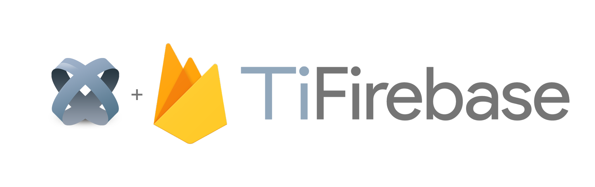

<p align="center"></p>

# Firebase in Appcelerator Titanium
This project will contain all Firebase-related modules for Analytics, Cloud-Messaging, Authentication, Firestore etc.

## Supporting this effort

The whole Firebase support in Titanium is developed and maintained by the community (`@hansemannn` and `@m1ga`). To keep
this project maintained and be able to use the latest Firebase SDK's, please see the "Sponsor" button of this repository,
thank you!

## Premium supporter

### Centreville Tech

Centreville Tech are strategic design+development advisors based in central Alabama.


## Requirements
- [x] iOS: Titanium SDK **9.2.0+**
- [x] Android: Titanium SDK **9.0.0+** and [Ti.PlayServices](https://github.com/appcelerator-modules/ti.playservices)

## Demo

⏩ [hansemannn/titanium-firebase-demo](https://github.com/hansemannn/titanium-firebase-demo)

## Installation

1. Download the core-module [titanium-firebase-core](https://github.com/hansemannn/titanium-firebase-core/releases)
2. Download the desired feature-module(s) from the below list
3. Unpack them to your project directory
4. Configure your Firebase project
	- <strong>iOS</strong>:
		- Download the `GoogleService-Info.plist` from your project and copy it to `[application_name]/Resources/iphone/` (classic) or `[application_name]/app/assets/iphone` (Alloy)
	- <strong>Android</strong>:
		- Download the `google-services.json` and copy it to `[application_name]/Resources/android/` (classic) or `[application_name]/app/platform/android/` (Alloy)


5. Require the your modules and call the `configure` method to configure your Firebase application:
```js
var FirebaseCore = require('firebase.core');
FirebaseCore.configure();
```
6. You are good to go!

## Android notes

For Android apps it is best to create a XML file at `platform/android/res/values/strings.xml` and place your configuration there:

```xml
<?xml version="1.0" encoding="utf-8"?>
<resources>
    <! -- Present in all applications -->
    <string name="google_app_id" translatable="false">xxx</string>
    <! -- Present in applications with the appropriate services configured -->
    <string name="gcm_defaultSenderId" translatable="false">xxx</string>
	<string name="default_web_client_id" translatable="false">xxx</string>
	<string name="firebase_database_url" translatable="false">xxx</string>
	<string name="google_api_key" translatable="false">xxx</string>
	<string name="google_crash_reporting_api_key" translatable="false">xxx</string>
	<string name="project_id" translatable="false">xxx</string>
</resources>
```

Use the values from the `google-services.json`.

## Features
The list of supported features will be updated once a new feature is added to the list.
Feel free to take over a new feature by creating the module and making a pull-request to update this readme.

| Feature | Repository | iOS | Android | Releases |
| ------- | ---------- | --- | ------- | -------- |
| **Core** (required) | **[titanium-firebase-core](https://github.com/hansemannn/titanium-firebase-core)** | ✅ | ✅ | [Download](https://github.com/hansemannn/titanium-firebase-core/releases) |
| Analytics | [titanium-firebase-analytics](https://github.com/hansemannn/titanium-firebase-analytics) | ✅ | ✅ | [Download](https://github.com/hansemannn/titanium-firebase-analytics/releases) |
| Performance | [titanium-firebase-performance](https://github.com/hansemannn/titanium-firebase-performance) | ✅ | ✅ | [Download](https://github.com/hansemannn/titanium-firebase-performance/releases) |
| Authentication | [titanium-firebase-auth](https://github.com/hansemannn/titanium-firebase-auth) | ✅ | ✅ | [Download](https://github.com/hansemannn/titanium-firebase-auth/releases) |
| Cloud Messaging | [titanium-firebase-cloud-messaging](https://github.com/hansemannn/titanium-firebase-cloud-messaging) | ✅ | ✅ | [Download](https://github.com/hansemannn/titanium-firebase-cloud-messaging/releases) |
| Crashlytics | [titanium-crashlytics](https://github.com/hansemannn/titanium-crashlytics) | ✅ | ✅ | [Download](https://github.com/hansemannn/titanium-crashlytics/releases) |
| Remote Config | [titanium-firebase-config](https://github.com/hansemannn/titanium-firebase-config) | ✅ | ✅ | [Download](https://github.com/hansemannn/titanium-firebase-config/releases) |
| Storage | [titanium-firebase-storage](https://github.com/hansemannn/titanium-firebase-storage) | ✅ | ❌ | [Download](https://github.com/hansemannn/titanium-firebase-storage/releases) |
| Database | [titanium-firebase-database](https://github.com/hansemannn/titanium-firebase-database) | ✅ | ❌ | [Download](https://github.com/hansemannn/titanium-firebase-database/releases) |

## ⚠️ Android Notes
If this module is used together with other modules that use the Google Play Services (e.g. Ti.Map or Ti.Admob)
you have to use at least Titanium SDK 7.0.0 for Android which resolves duplicate dependencies for you.

Latest module versions that support 7.0.0 and have Ti.PlayServices included:
  - [Ti.Map 4.0.0](https://github.com/appcelerator-modules/ti.map/releases/tag/android-4.0.0)
  - [Ti.Admob 4.0.0](https://github.com/appcelerator-modules/ti.admob/releases/tag/android-4.0.0)

You are not using 7.0.0 because of modules that are not updated so far? Update open source modules quickly by using
the [Android 64-Bit Migration Guide](http://docs.appcelerator.com/platform/latest/#!/guide/Android_Module_Upgrade_Guide).

### Disable Analytics

By default Firebase trys to use Analytics and you might see the erros in your log:
```bash
[ERROR] FA: AppMeasurementReceiver not registered/enabled
[ERROR] FA: AppMeasurementService not registered/enabled
[ERROR] FA: Uploading is not possible. App measurement disabled
```
To disable them you can add the follwing elements to the `<application>` part of your tiapp.xml:
```xml
<application>
	<meta-data android:name="firebase_analytics_collection_enabled" android:value="false"/>
	<meta-data android:name="google_analytics_adid_collection_enabled" android:value="false"/>
</application>
```

## Contributors
* Please see https://github.com/hansemannn/titanium-firebase/graphs/contributors
* Interested in contributing? Read the [contributors/committer's](https://wiki.appcelerator.org/display/community/Home) guide.

## License
Apache 2.0
